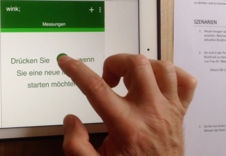

# wink-ui
### Hi-Fi Prototype der Benutzerschnittstelle für die Telemedizin-App 'Wink'
 
Erarbeiten einer grafischen Benutzerschnittstelle für die Telemedizin-App 'Wink' mit agilen Methoden des User-centered Design. 

Nach einem Entwurf der Benutzerschnittstelle als [Lo-Fi Prototype](https://speakerdeck.com/brugr9/wink-lo-fi-prototype) mit Balsamiq wurde mit Axure RP dieser Hi-Fi Prototype erstellt. Er bildet die Szenarien aus dem Detailkonzept ab (siehe [Bericht](https://www.hashdoc.com/documents/476937/user-centered-design-f-r-mobile-app)). Der Hi-Fi Prototype wurde für die Usability-Tests verwendet (siehe [Screencast Testperson 1](https://vimeo.com/210055843) und [Screencast Testperson 1](https://vimeo.com/210064865)).

Studiengang: BFH-TI, Informatik, Modul BTI7083 User-centered Design, Semesterarbeit

Autoren: Sandro Blatter, Roland Bruggmann, Michael Ramahenina, Glenn Ryser.

Datum: 19. Januar 2016
